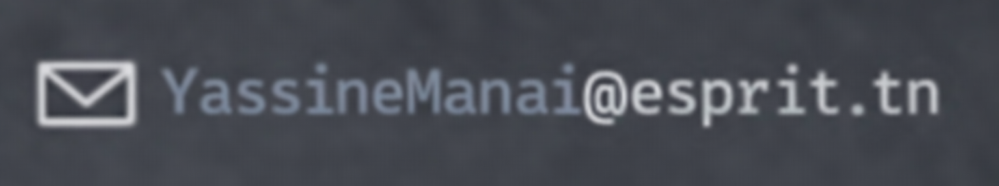

  

  

- Web Engineer with strong experience building modern, scalable web applications using the JavaScript ecosystem, mainly React and Node.js, in real-world academic and project-based environments
- Focused on frontend development, UI architecture, and performance-aware interfaces, with attention to both technical quality and user experience
- Experience designing and developing full-stack applications using the MERN stack, from API design to frontend integration
- Solid understanding of backend concepts and APIs, enabling a holistic and product-oriented approach to feature development
- Active contributor within team projects, participating in code reviews, technical discussions, and collaborative problem solving
- Strong concern for code quality, maintainability, documentation, developer experience (DX), and long-term scalability

### Main stack

- **Core & Data:** React.js, Next.js, Vite, JavaScript (ES6+), TypeScript, Node.js, Express.js, MongoDB, REST APIs
- **Architecture & Quality:** MERN Stack, Component-Based Architecture, Clean Code, MVC, Git & GitFlow, Agile/Scrum
- **UI & Others:** Tailwind CSS, CSS3, HTML5, Responsive Design, Basic Animations, SEO fundamentals, Docker basics, Linux (Ubuntu / Arch)

> Outside of work: Anime · Music · MMO Games

  
  

  
  

 

  

