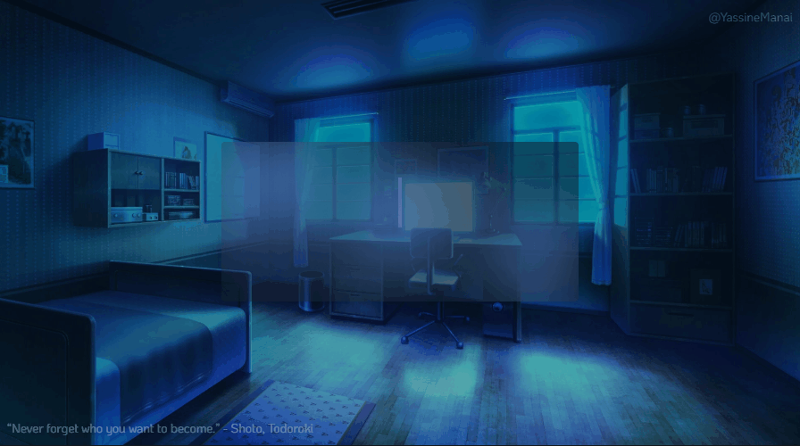

  

  

<ul>
  <li>🤩️ Passionate about programming, technology, and continuous learning.</li>
  <li>🔭 I have a strong foundation in both Front-end and Back-end technologies.</li>
  <li>💻 I am currently building projects involving Web Applications, Microservices, and Dashboard interfaces, with a focus on Angular, Spring Boot, and .NET Core..</li>
  <li>📚 <b>📚 I am pursuing a degree in IT Engineering and actively expanding my skills through real-world projects, internships, and personal development.</li>
  <li>🇺🇸 I have a good level of English and use it daily in technical contexts.</li>
  <li>🎮 In my free time, I enjoy gaming, exploring new tech trends, and working on side projects to sharpen my skills..</li>
  <li>
    

      
👽 Curiosities:

      <ul>
        <li>🤖 My daily life runs smoother thanks to a touch of JavaScript magic.</li>
        <li>⛩️ 500+ animes later, I’m still hunting for the next masterpiece.</li>
        <li>✒️ I code in black and white — literally. My VSCode is pure monochrome aesthetic.</li>
      </ul>
    

  </li>
</ul>

  

<table align="right" height="251px">
  <tr>
    <td align="center">
      <a href="https://pt-br.reactjs.org/">
         
        
          <b>
            <pre>React.js</pre>
          </b>
        
      </a>
    </td>
    <td align="center">
      <a href="https://nextjs.org/">
         
        
          <b>
            <pre>Angular</pre>
          </b>
        
      </a>
    </td>
    <td align="center">
      <a href="https://www.typescriptlang.org/">
         
        
          <b>
            <pre>Typescript</pre>
          </b>
        
      </a>
    </td>
    <td align="center">
      <a href="https://tailwindcss.com/">
       
      
        <b>
          <pre>Tailwind CSS</pre>
        </b>
      
      </a>
    </td>
    <td align="center">
      <a href="https://github.com/">
         
        
          <b>
            <pre>Gitflow</pre>
          </b>
        
      </a>
    </td>
  </tr>
    <tr>
    <td align="center">
      <a href="https://firebase.google.com/">
         
        
          <b>
            <pre>Firebase</pre>
          </b>
        
      </a>
    </td>
    <td align="center">
      <a href="https://graphql.org/">
         
        
          <b>
            <pre>GraphQL</pre>
          </b>
        
      </a>
    </td>
    <td align="center">
      <a href="https://getbootstrap.com/">
       
      
        <b>
          <pre>Bootstrap</pre>
        </b>
      
      </a>
    </td>
       <td align="center">
          <a href="https://getbootstrap.com/">
       
        
          <b>
            <pre>java</pre>
          </b>
        
      </a>
    </td>
       <td align="center">
      <a href="https://getbootstrap.com/">
       
        
          <b>
            <pre>Android Studio</pre>
          </b>
        
      </a>
    </td>
  </tr>
  <tr>
    <td align="center">
      <a href="https://sass-lang.com/">
         
        
          <b>
            <pre>Sass</pre>
          </b>
       </a>
      
    </td>
    <td align="center">
     <a href="https://getbootstrap.com/">
       
      
        <b>
          <pre>PHP</pre>
        </b>
      
      </a>
    </td>
    <td align="center">
       <a href="https://getbootstrap.com/">
       
        
          <b>
            <pre>Python</pre>
          </b>
        
      </a>
    </td>
          <td align="center">
      <a href="https://stripe.com/en-br/">
         
        
          <b>
            <pre>Stripe</pre>
          </b>
        
      </a>
    </td>
    <td align="center">
      <a href="https://redux.js.org/">
         
        
          <b>
            <pre>Redux Toolkit</pre>
          </b>
        
      </a>
    </td>
  </tr>
 
  <tr>
      <td align="center">
      <a href="https://expressjs.com/">
         
        
          <b>
            <pre>Express.js</pre>
          </b>
        
      </a>
    </td>
    <td align="center">
      <a href="https://reactnative.dev/">
         
        
          <b>
            <pre>React Native</pre>
          </b>
        
     </a>
    </td>
    <td align="center">
       <a href="https://getbootstrap.com/">
       
        
          <b>
            <pre>C#</pre>
          </b>
        
     </a>
    </td>
    <td align="center">
      <a href="https://getbootstrap.com/">
       
      
        <b>
          <pre>Docker</pre>
        </b>
      
      </a>
    </td>
    <td align="center">
      <a href="https://nodejs.org/en">
         
        
          <b>
            <pre>Node.js</pre>
          </b>
        
      </a>
    </td>
  </tr>
  <tr>
     <td align="center">
      <a href="https://developer.mozilla.org/en-US/docs/Web/JavaScript/">
         
        
          <b>
            <pre>Javascript</pre>
          </b>
        
      </a>
    </td>
     <td align="center">
      <a href="https://developer.mozilla.org/en-US/docs/Web/JavaScript/">
         
        
          <b>
            <pre>MongoDB</pre>
          </b>
        
      </a>
    </td>
     <td align="center">
      <a href="https://developer.mozilla.org/en-US/docs/Web/JavaScript/">
         
        
          <b>
            <pre>MySQL</pre>
          </b>
        
      </a>
    </td>
     <td align="center">
      <a href="https://developer.mozilla.org/en-US/docs/Web/JavaScript/">
         
        
          <b>
            <pre>.NET</pre>
          </b>
        
      </a>
    </td>
    <td align="center">
      <a href="https://developer.mozilla.org/en-US/docs/Web/CSS/">
         
        
          <b>
            <pre>CSS3</pre>
          </b>
        
      </a>
    </td>
  </tr>
   <tr>
     <td align="center">
      <a href="https://developer.mozilla.org/en-US/docs/Web/HTML/">
         
        
          <b>
            <pre>HTML5</pre>
          </b>
        
      </a>
    </td>
    <td align="center">
      <a href="https://ohmyz.sh/">
         
        
          <b>
            <pre>Terminal</pre>
          </b>
        
      </a>
    </td>
    <td align="center">
      <a href="https://code.visualstudio.com/">
         
        
          <b>
            <pre>VSCode</pre>
          </b>
        
      </a>
    </td>
    <td align="center">
      <a href="https://pop.system76.com/">
         
        
          <b>
            <pre>Linux & Windows</pre>
          </b>
        
      </a>
    </td>
     <td align="center">
      <a href="https://developer.mozilla.org/en-US/docs/Web/JavaScript/">
         
        
          <b>
            <pre>Blender</pre>
          </b>
        
      </a>
    </td>
   </tr>
</table>
            

  

   

  <a href="mailto:Yassine.Manai@esprit.tn" target="_blank">
    
    &nbsp;
  </a>
  <a href="https://www.linkedin.com/in/yassine-manai-1b683623b/" target="_blank">
    
    &nbsp;
  </a>
  <a href="https://www.instagram.com/_yasyne_/" target="_blank">
    
    &nbsp;
  </a>
  

  

  

<table height="491px" align="right">
  <tr>
    <td>
    
    </td>
  </tr>
  <tr>
    <td>
    
    </td>
  </tr>
     <tr>
    <td>
    
    </td>
  </tr>
   <tr>
    <td>
    
    </td>
  </tr>
   <tr>
    <td>
    
    </td>
  </tr>
   <tr>
    <td>
    
    </td>
  </tr>
     <tr>
    <td>
    
    </td>
  </tr>
     <tr>
    <td>
    
    </td>
  </tr>
       <tr>
    <td>
    
    </td>
  </tr>
        <tr>
    <td>
    
    </td>
  </tr>
    <td>
    
    </td>
  </tr>
  
  
</table>
                        

   

 

